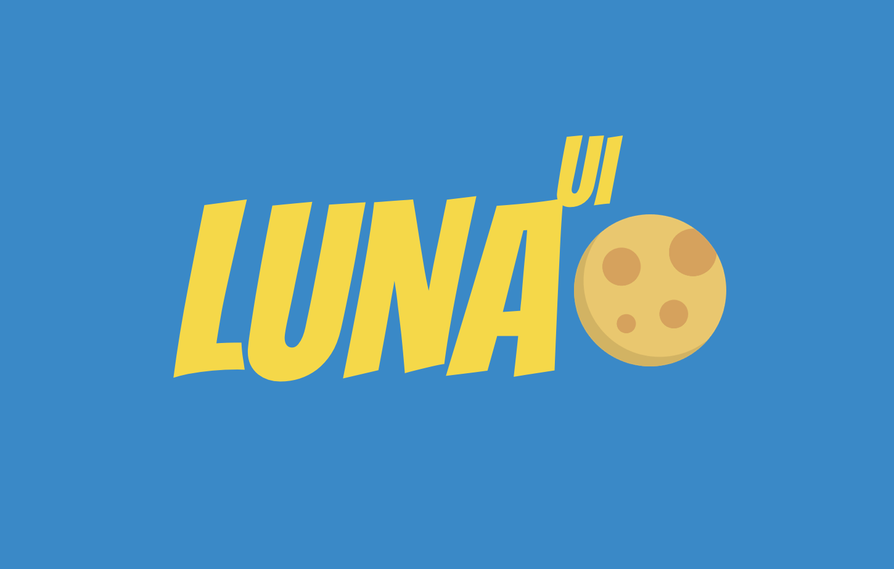

# Luna-ui
A React ui-lib built with StyledComponents

 
 
 ## Tech Stack

| ES2018 | React | Styled Components | Jest |
|:------:|:-------:|:-----:|:----:|
|  |  |   |  |


 ## Install

 ```
  yarn add luna-ui-lib
 ```

## Unit Tests
To run the unit tests:
```
yarn test
```

## Docs
* [Storybook](https://luna-ui-lib.github.io/luna-ui/index.html?path=/story/*) - `./docs`

## Project Structure
```
.
+-- README.md
+-- .gitignore
+-- .babelrc
+-- .npmignore
+-- package.json
+-- /docs
|   +-- ... github pages content
+-- /stories
|   +-- ...
+-- /src
|   +-- /components
|   |   +-- ...
|   +-- /config
|   |   +-- ...
|   +-- index.js
|   +-- setupTests.js
```

## Team
|  |  |   |
|:------:|:-------:|:-----:|
| [@mogobruno](https://www.github.com/mogobruno) | [@rmdias](https://www.github.com/rmdias) | [@sppiotrowski](https://www.github.com/sppiotrowski) |
